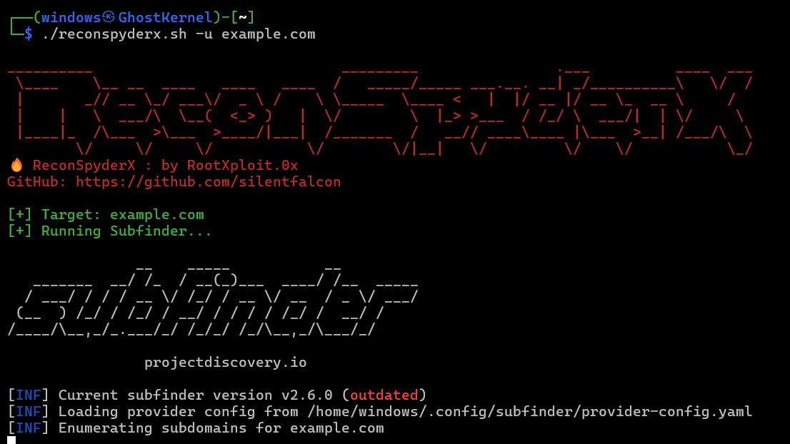

<h1 align="center">
  <a href="https://github.com/silentfalcon/ReconSpyderX"></a>
  <br>
  ReconSpyderX
  
</h1>

<p align="center">
  <a href="https://github.com/silentfalcon/ReconSpyderX/releases">
    
  </a>
  <a href="https://opensource.org/licenses/MIT">
    
  </a>
  <a href="https://github.com/silentfalcon/ReconSpyderX/issues?q=is%3Aissue+is%3Aclosed">
    
  </a>
  <a href="https://github.com/silentfalcon/ReconSpyderX/wiki">
    
  </a>
</p>
<div align="center">
  <a href="https://www.linkedin.com/in/vyankatesh-shinde-%F0%9F%87%AE%F0%9F%87%B3-2bb222219/">
    
  </a>
  <a href="https://x.com/rootxploit_0x">
    
  </a>
  <a href="https://www.instagram.com/rootxploit.0x/">
    
  </a>
  <a href="https://tryhackme.com/r/p/rootxploit.0x">
    
  </a>
  <a href="https://medium.com/@rootxploit0x">
    
  </a>
</div>

---

🚀 **ReconSpyderX** is your all-in-one 🔍 reconnaissance powerhouse for **bug bounty hunters** 🕵️‍♂️ and **penetration testers** 💻.  
It automates the boring stuff and supercharges your workflow ⚡ by combining:  
🌐 Subdomain Discovery,  
🔗 HTTP Probing,  
🛡️ Vulnerability Scanning,  
🕸️ Dorking Tricks & 
📊 OSINT Gathering —  
all in one streamlined tool that saves time ⏳ and delivers results 📈.


---

## 📔 Table of Contents
- [✨ Features](#-features)
- [📦 Installation](#-installation)
- [🚀 Usage](#-usage)
- [🧾 Output](#-output)
- [⚙️ Requirements](#️-requirements)
- [⚠️ Disclaimer](#️-disclaimer)
- [🤝 Contributing](#-contributing)
- [📜 License](#-license)

---

## ✨ Features
- Subdomain enumeration (**Subfinder**)
- Live host detection (**httpx**)
- Vulnerability scanning (**nuclei**)
- Wayback Machine URL collection (**waybackurls**)
- DAST scanning on archived URLs
- Shodan IP search & IP-based nuclei scanning
- Google & GitHub dork links

---

<a href="https://github.com/silentfalcon/ReconSpyderX"></a>

## 📦 Installation

### Clone the repository
```bash
git clone https://github.com/silentfalcon/ReconSpyderX.git
cd ReconSpyderX
```

### Install dependencies
```bash
chmod +x reconspyderx.sh tools.sh
bash tools.sh
```

Make sure your Go bin path is exported:
```bash
export PATH=$PATH:$HOME/go/bin
```

---

## 🚀 Usage
```bash
bash reconspyderx.sh -u target.com
```

All results will be saved in a folder named `target.com-recon/`.

---

## 🧾 Output
Example output directory:
```
target.com-recon/
│── subdomains.txt
│── httpx.txt
│── nuclei-output.txt
│── wayback.txt
│── dast-result.txt
│── shodan.txt
│── ip-nuclei.txt
│── google-dorks.txt
│── github-dorks.txt
```

---

## ⚙️ Requirements
- Linux / macOS
- **Go 1.18+**
- **pip3** (for Shodan CLI)
- Bash shell

---

## ⚠️ Disclaimer
This tool is for **educational purposes** and **authorized security testing only**.  
The author assumes **no liability** for misuse or damage caused by this tool.  
Always ensure you have **explicit permission** before scanning any target.

---

## 🤝 Contributing
Contributions, issues, and feature requests are welcome!  
Please read [CONTRIBUTING.md](CONTRIBUTING.md) before submitting.

---

## 📜 License
This project is licensed under the **MIT License** — see [LICENSE](LICENSE) for details.

---

## ⭐ Star History
[](https://star-history.com/#silentfalcon/ReconSpyderX&Date)

---

<p align="center">Made with ❤️ by <a href="https://github.com/silentfalcon">RootXploit.0x</a></p>

<div align="center">
  <p>⭐️ Thank You For Visiting!</p>
</div>
</br>
<p align="center">
<a>🌱</a>
</p>
